<!-- PROJECT LOGO -->
<br />
<p align="center">
  <a href="https://github.com/qiandongyq/cookie-bus">
    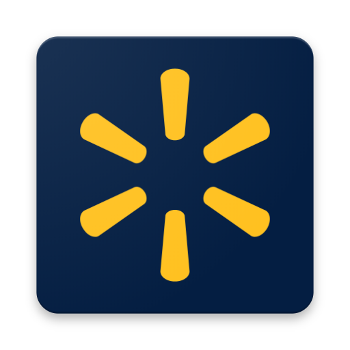
  </a>

  <h3 align="center">Walmart Dev Toolkit</h3>
  <p align="center">
    </br>
    <a href="https://gecgithub01.walmart.com/d0q006u/walmart-dev-toolkit/releases/download/1.0.0/walmart-dev-toolkit-1.0.0.zip"><strong>Download here (1.0.0) »</strong></a>
    <br />
    <br />
    <a href="https://gecgithub01.walmart.com/d0q006u/walmart-dev-toolkit/issues">Report Bug</a>
    ·
    <a href="https://gecgithub01.walmart.com/d0q006u/walmart-dev-toolkit/issues">Request Feature</a>
  </p>
</p>

<!-- TABLE OF CONTENTS -->

## Table of Contents

- [About the Project](#about-the-project)
- [Core Features](#core-features)
- [QOL Features](#qol-features)
- [Update Extension](#update-extension)
- [Usage](#usage)
- [Contributing](#contributing)

## About The Project

**Walmart dev toolkit is aimed at creating an automated way to provide a more enjoyable development environment for Walmart developers and QEs.**

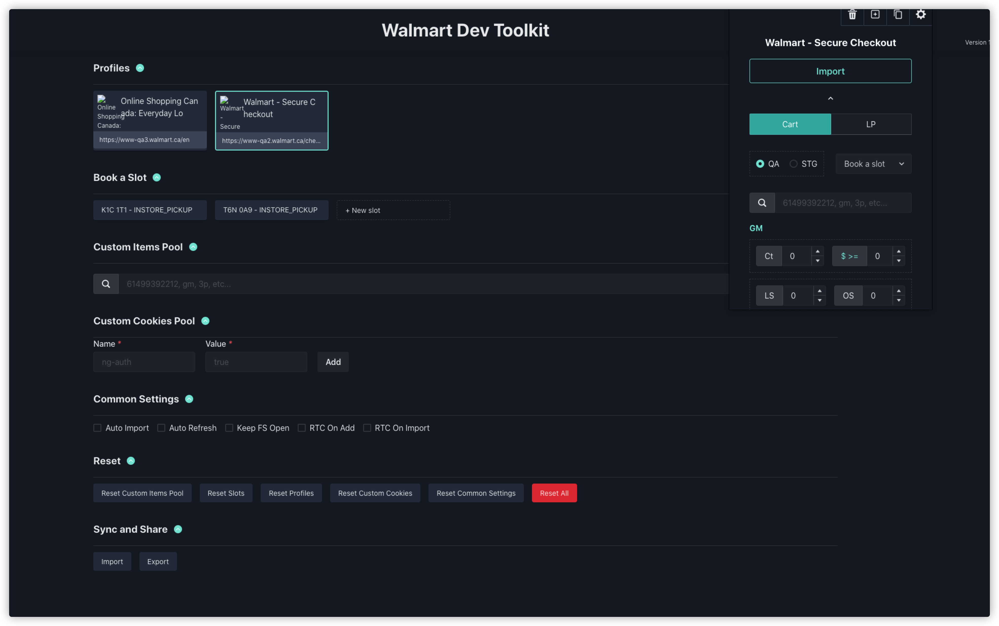

## Core Features

- Easy Cart
  - Add an item using indexed search by offer type, item type, skuId, offerId and price.
    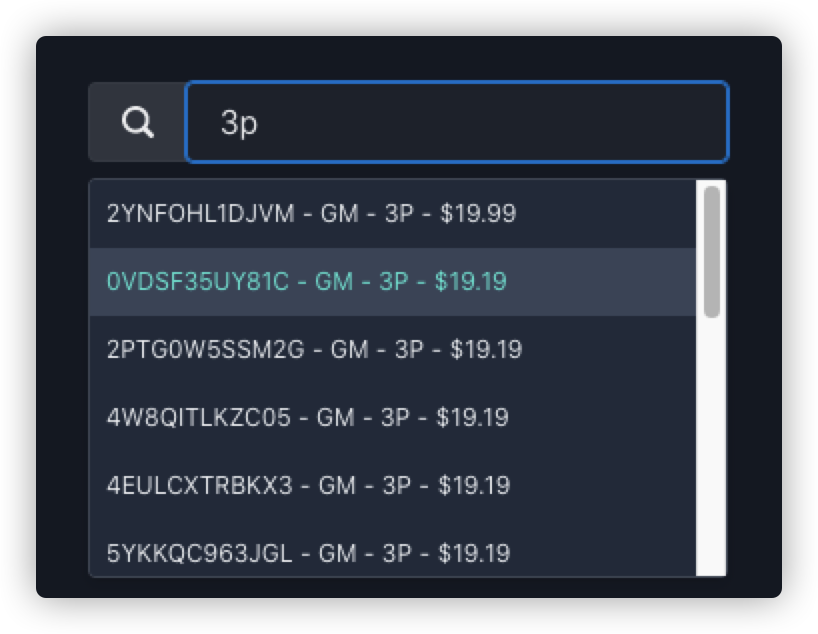
  - Add an item using the quick custom number inputs which can be filtered by price, out of stock, limited stock, 3P and digital items.
    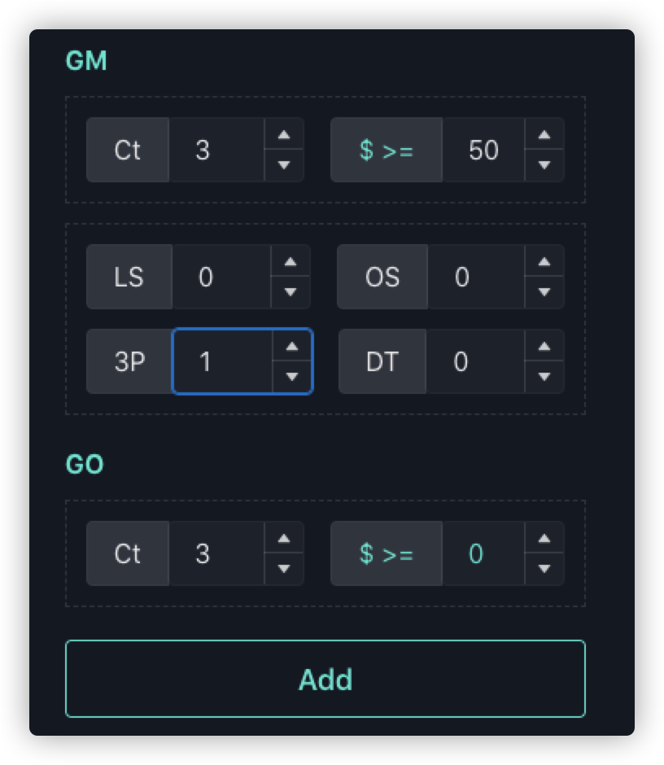
  - Add an item within your custom items pool.
    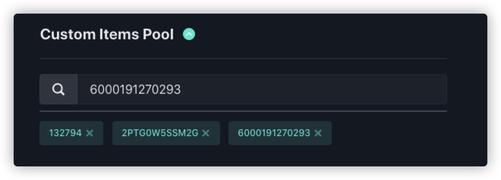
- Easy Slot
  - Add a slot from the pre-defined pickup slots (K1C1T1 and T6N0A9).
    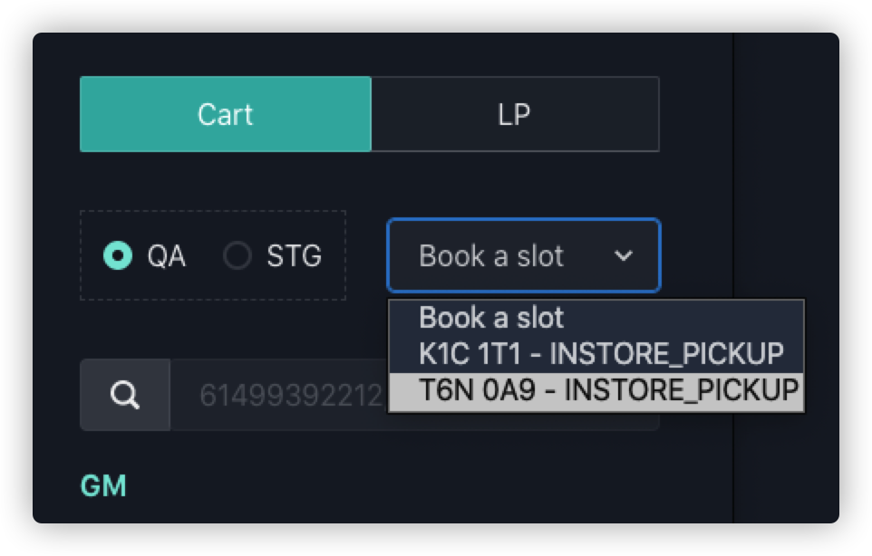
  - Add a slot from your custom slots pool.
    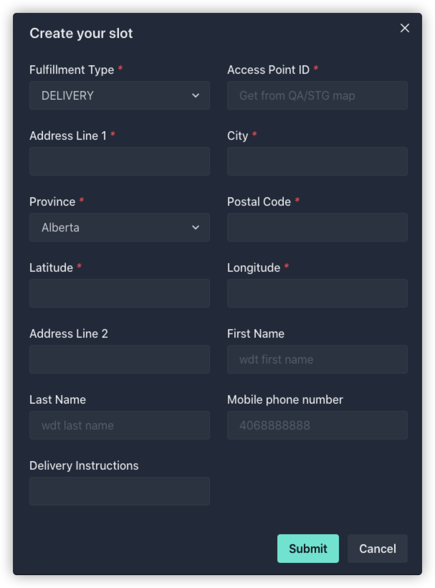
- Easy Cookies
  - Import cookie from QA2/STG or any site in your profiles
    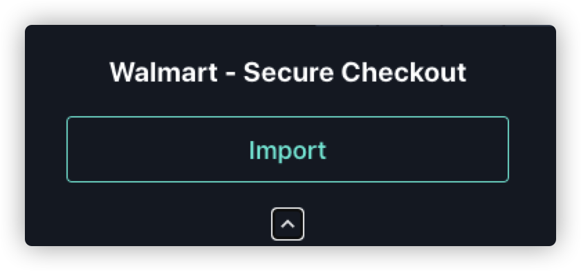
  - Appending your custom cookies alongside with import cookies
    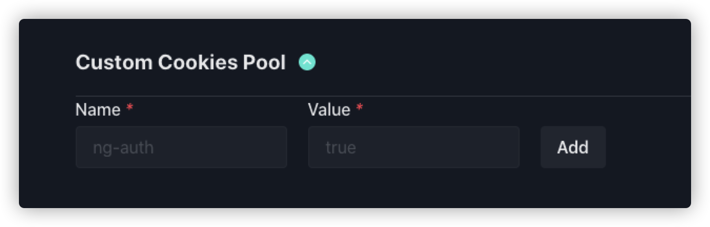

## QOL Features

- Auto refresh
- Auto import cookies
- Auto redirect
- LP decode with nice format
- Delete all cookies
- Export cookie strings (used for quickly create a cart in Safari)
- Export all custom profile, slots, cookies and setting to a file
- Import all custom profile, slots, cookies and setting from a file
  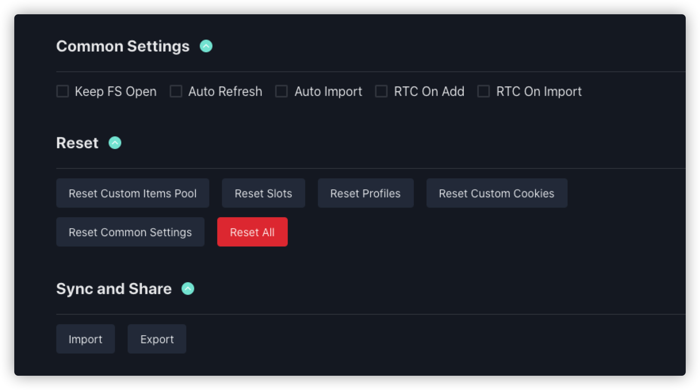
  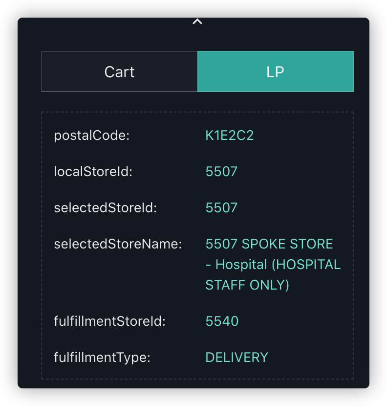

## Update Extension

Install the new version of the extension will remove all your custom profiles, slots, cookies and settings. Please remember to export them to a file before you re-install the extension. After the reinstallation is done, import the file you exported and you are good to go.

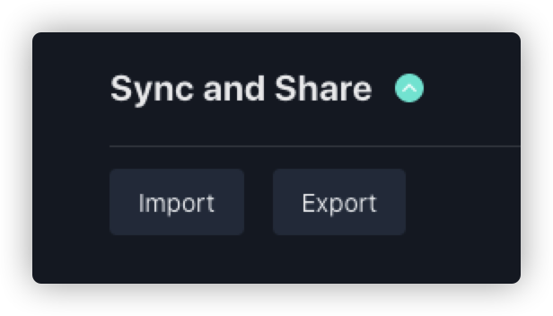

## Usage

### Running The Extension

1. Run `yarn` in the folder to install dependencies
2. Run `yarn dev` to start the development server (auto refreshes your extension on change)
3. Navigate to `chrome://extensions` in your browser
4. Ensure `Developer mode` is `enabled` (top right)
5. Click `Load unpacked` in the top left
6. Select the `/build` folder in this directory

After completing the above steps, you should see the developer, unpacked version appear in your extension list as well as the extension icon appear in your browser bar alongside the other extensions you may have installed.

To trigger the extension, simply click the extension icon.

Although you can still use `yarn start` if you'd like to run the app like a normal CRA React app and outside of the Chrome ecosystem, it is not recommended as it will often require additional configuration and any specific Chrome APIs will likely not work. If you decide on this route, you'd need to run `yarn build` and then follow steps 3-6 above when you want to test as an unpacked extension as this will not update the build and refresh on every change.

### All Available Commands

- `yarn dev` - (RECOMMENDED) creates a development server that can be used for hot reloading
- `yarn start` - (NOT RECOMMENDED) starts the normal CRA development server
- `yarn build` - create a production ready build
- `yarn postbuild` - copies required Chrome extension files after build has completed
- `yarn assemble` - creates a production ready build and zips all files needed to publish in the web store to `walmart-dev-toolkit-*.zip`
  inside the Google Chrome extension ecosystem (see steps 1-6 above)
- `yarn test` - runs any Jest tests you may have
- `yarn eject` - ejects out of Create React App (Not recommended)
- `yarn pretty` - runs prettier on the `/src` folder
- `yarn lint` - runs eslint on the `/src` folder

### Making Changes

Afer starting the dev server via `yarn dev`, changes will be automatically be rebuilt to `/build` via webpack and the unpacked Chrome extension will automatically be refreshed for you behind the scenes, meaning you don't need to press the refresh button on `chrome://extensions`. Note: you may need to re-toggle or refresh the popup / page to see actual UI changes reflected there after a rebuild (i.e. re-open it again by clicking the icon again).

## Manifest Explained

There are 2 key sections of the manifest with this example template:

### Browser Action

```
  "browser_action": {
    "default_icon": {
      "32": "icon.png"
    },
    "default_popup": "index.html/#popup",
    "default_title": "Open Popup"
  }
```

This portion of the manifest is used to define how the browser action (extension icon) should behave. In this case, we tell it we want to use the `index.html` file, which is where the React app is rendered. You'll notice we specifically use `index.html/#popup` because the app uses hash routing. In order to have both a popup and full page, we need to provide the same React app to both, but tell it how to route to the proper component (i.e. either popup or full page) based on the hash.

Inside `app.js`, you'll see the following:

```
<Switch>
  <Route exact path="/" component={FullPage} />
  <Route exact path="/popup" component={Popup} />
</Switch>
```

This is where the routing happens and how the app knows to either render the popup or full page. If we we're to define a new route with path `/example`, it would render that component when we go to `index.html/#example`, for example. You'll also notice the full page just uses the base `/`, which means simply visiting `index.html` will render that component. This appears in the following code in `screen/popup.js` (inside the popup component):

```
  const handleClick = () => {
    chrome.tabs.create({
      url: chrome.extension.getURL('/index.html'),
    });
  };
```

When the button on the popup is clicked, this function is called. It simply creates a new tab via the Chrome API and routes them to `index.html` and as mentioned above, since it includes no hash, it goes to the `/` route, which in this case is the full page component.

### Preparing to Release

To prepare for publish, simply run `yarn assemble` which will kick off a production-ready build step and then zip all the contents to `walmart-dev-toolkit-*.zip` in the folder root. This zip file will include all the files you need for your extension to be uploaded to the web store.

## Need More help?

Submit an issue ticket

## Contributing

Contributions are what make this project grow. Let's help each other and create an enjoyable development environment.
